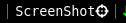

# screenshot

Add a button to take screenshots easily using single click. Screenshots are
saved in HOME directory or any directory specified in config.



# Usage

This block is run when clicked. It allows the user to capture a screenshot
in two mode
- Left Click - capture the selected region on screen
- Right Click - capture the complete screen

It requires `ImageMagick` package as dependency, which can be downloaded from your
official package manager.

# Config
```
[screenshot]
command=$SCRIPT_DIR/screenshot
full_text=ScreenShot 
FORMAT=png
#SAVE_DIR=< home dir >/screenshots
```
